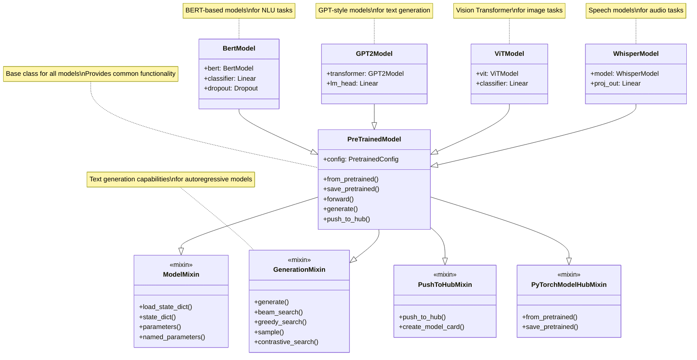

<!--Copyright 2020 The HuggingFace Team. All rights reserved.

Licensed under the Apache License, Version 2.0 (the "License"); you may not use this file except in compliance with
the License. You may obtain a copy of the License at

http://www.apache.org/licenses/LICENSE-2.0

Unless required by applicable law or agreed to in writing, software distributed under the License is distributed on
an "AS IS" BASIS, WITHOUT WARRANTIES OR CONDITIONS OF ANY KIND, either express or implied. See the License for the
specific language governing permissions and limitations under the License.

⚠️ Note that this file is in Markdown but contain specific syntax for our doc-builder (similar to MDX) that may not be
rendered properly in your Markdown viewer.

-->

# Technical Architecture

This document provides comprehensive technical architecture documentation for the 🤗 Transformers library, including system overview, component interactions, and detailed architectural diagrams using Mermaid.

## System Overview

The 🤗 Transformers library is designed as a comprehensive machine learning framework that provides state-of-the-art pretrained models for natural language processing, computer vision, audio, and multimodal tasks. The architecture is built around three core principles: simplicity, flexibility, and performance.


## Core Components Architecture

The library is organized around several key architectural components that work together to provide a unified interface for machine learning tasks.


## Model Class Hierarchy

The model architecture follows a hierarchical design pattern that enables code reuse and consistent behavior across different model types.



## Pipeline Architecture

The Pipeline API provides a high-level interface that abstracts the complexity of preprocessing, model inference, and postprocessing.


## Training and Inference Flow

The library supports both training and inference workflows with optimized data paths and memory management.


## Framework Integration Architecture

The library supports multiple deep learning frameworks through a unified interface while maintaining framework-specific optimizations.


## Hub Integration and Model Lifecycle

The integration with Hugging Face Hub enables seamless model sharing, versioning, and deployment.

```mermaid
graph TB
    subgraph "Local Environment"
        LocalModel[Local Model]
        LocalConfig[Local Config]
        LocalTokenizer[Local Tokenizer]
        Cache[Local Cache]
    end
    
    subgraph "Hugging Face Hub"
        ModelRepo[Model Repository]
        ConfigFile[config.json]
        TokenizerFiles[Tokenizer Files]
        ModelWeights[Model Weights]
        ModelCard[Model Card]
        Tags[Tags & Metadata]
    end
    
    subgraph "Model Operations"
        Download[Download]
        Upload[Upload/Push]
        VersionControl[Version Control]
        Authentication[Authentication]
    end
    
    LocalModel -->|push_to_hub()| Upload
    Upload --> ModelRepo
    Upload --> ModelWeights
    Upload --> ModelCard
    
    Download -->|from_pretrained()| LocalModel
    Download --> Cache
    ModelRepo --> Download
    ConfigFile --> Download
    TokenizerFiles --> Download
    ModelWeights --> Download
    
    LocalConfig <--> ConfigFile
    LocalTokenizer <--> TokenizerFiles
    
    VersionControl --> ModelRepo
    Authentication --> Upload
    Authentication --> Download
    
    Tags --> ModelRepo
    ModelCard --> Tags
```

## Memory and Performance Optimization

The library includes various optimization strategies for different deployment scenarios.


## Auto Classes and Dynamic Loading

The Auto classes provide intelligent model, configuration, and tokenizer selection based on model checkpoints.


## Security and Safety Architecture

The library incorporates multiple layers of security and safety measures.


## Conclusion

The 🤗 Transformers library architecture is designed to provide a unified, flexible, and performant framework for state-of-the-art machine learning models. The modular design enables:

- **Simplicity**: Easy-to-use APIs that abstract complexity
- **Flexibility**: Support for multiple frameworks and deployment scenarios  
- **Performance**: Optimized inference and training with various acceleration options
- **Scalability**: From single models to distributed training and inference
- **Security**: Comprehensive safety measures and validation
- **Extensibility**: Clear patterns for adding new models and features

This architecture supports the library's mission to democratize machine learning by making state-of-the-art models accessible to researchers, practitioners, and engineers across different use cases and deployment environments.